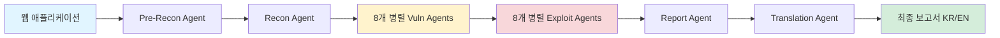
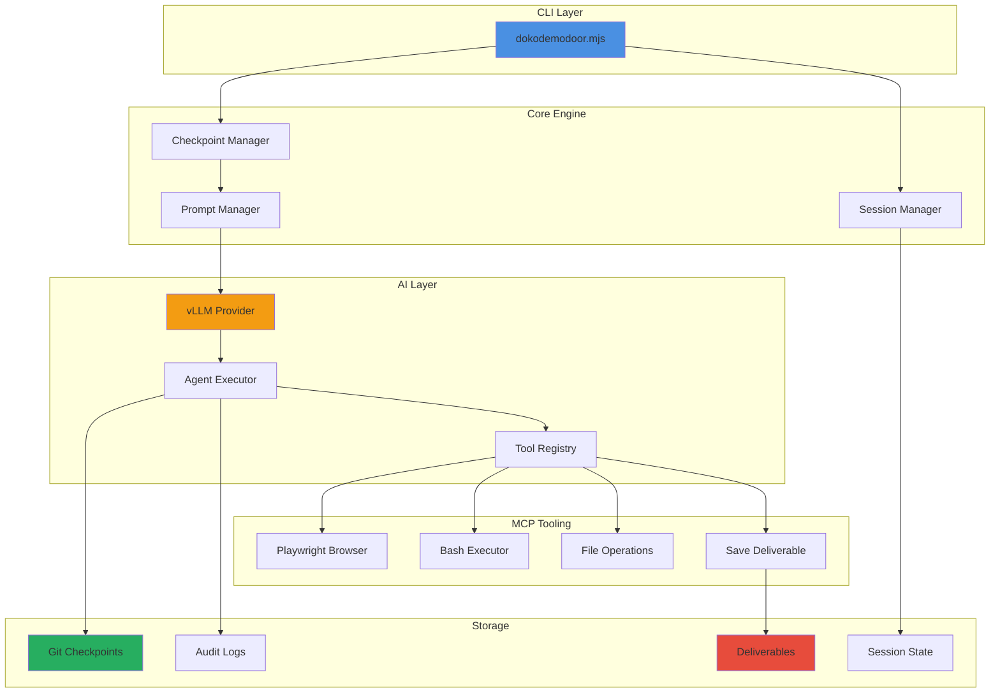
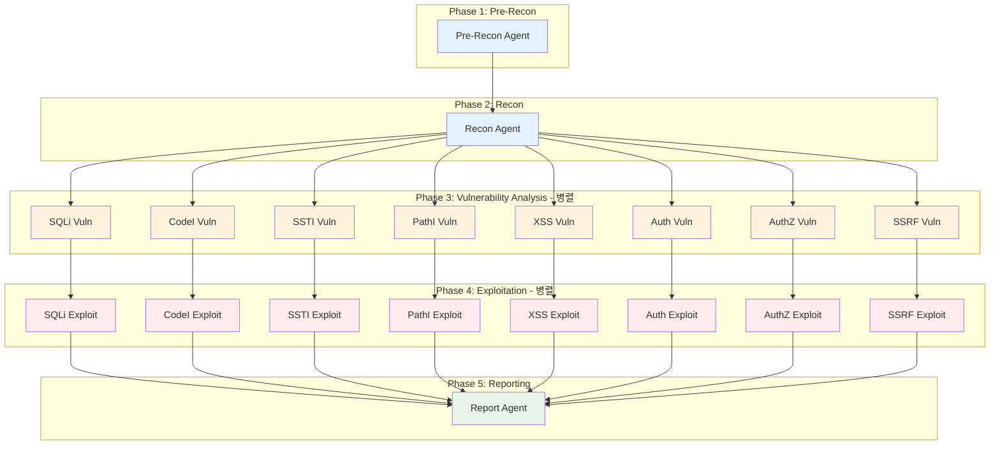
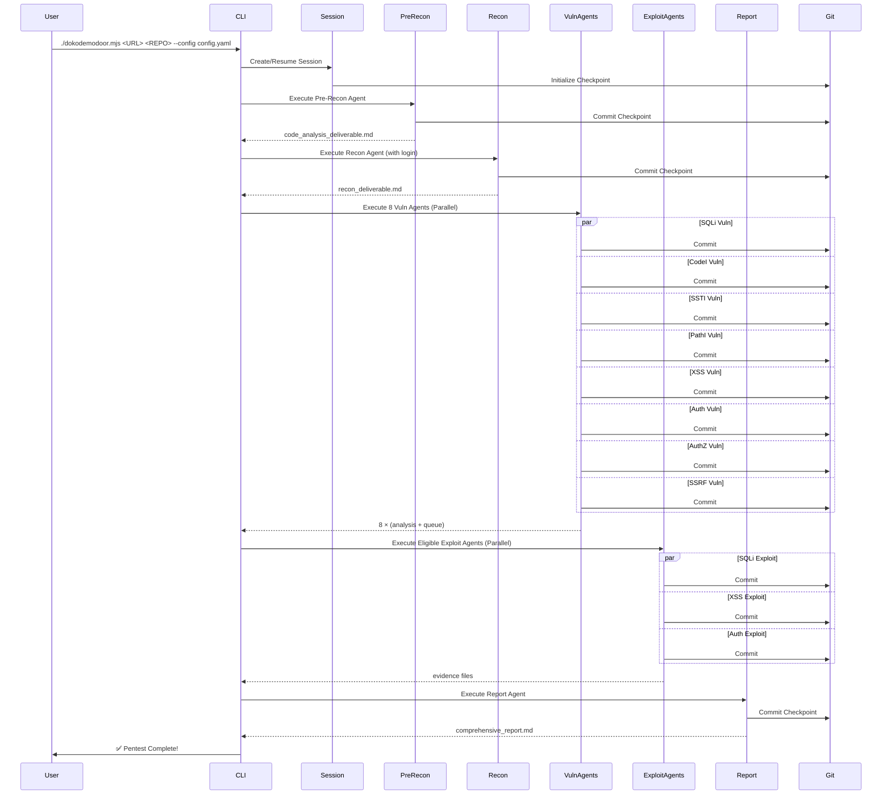

# 🚪 DokodemoDoor: AI Agent 기반 자율형 모의침투 플랫폼

<div align="center">

**차세대 AI 보안 테스팅 엔진 - 정찰부터 보고서 작성까지 완전 자동화**

[](LICENSE)
[](https://nodejs.org/)
[](https://openai.com/)

</div>

---

## 📋 목차

- [🎯 프로젝트 개요](#-프로젝트-개요)
- [✨ 핵심 특징](#-핵심-특징)
- [🏗️ 시스템 아키텍처](#️-시스템-아키텍처)
- [🤖 AI Agent 시스템](#-ai-agent-시스템)
- [🔄 전체 파이프라인](#-전체-파이프라인)
- [🛠️ 기술 스택](#️-기술-스택)
- [🚀 빠른 시작](#-빠른-시작)
- [📊 성능 및 확장성](#-성능-및-확장성)
- [🔒 보안 및 안전장치](#-보안-및-안전장치)
- [📈 프로젝트 규모](#-프로젝트-규모)
- [🎓 사용 사례](#-사용-사례)
- [🔮 향후 발전 방향](#-향후-발전-방향)

---

## 🎯 프로젝트 개요

**DokodemoDoor**는 **AI Agent 기반의 완전 자율형 모의침투 테스팅 플랫폼**입니다.

전통적인 보안 테스팅은 수동 작업과 반복적인 프로세스로 인해 많은 시간과 전문 인력이 필요합니다. DokodemoDoor는 이러한 한계를 극복하기 위해 **19개의 전문 AI Agent**를 활용하여 정찰부터 취약점 분석, 검증, 보고서 작성, 그리고 한글 번역까지 **완전한 End-to-End 파이프라인**을 제공합니다.

### 🎪 왜 DokodemoDoor인가?

> **"어디든지 문(どこでもドア)"** - 어떤 웹 애플리케이션이든 자동으로 보안 점검의 문을 열어드립니다.

- ✅ **완전 자동화**: 사람의 개입 없이 정찰 → 분석 → 검증 → 보고서 생성
- ✅ **전문가급 품질**: 각 취약점 유형별 전문 Agent가 심층 분석
- ✅ **증거 기반**: 모든 결론은 코드 레벨 근거와 실제 검증 결과로 뒷받침
- ✅ **대규모 보고서 지원**: 자동 분할 번역으로 100페이지 이상의 보고서도 처리
- ✅ **독립적 실행**: OpenAI 호환 vLLM 기반으로 로컬 LLM 환경에서도 작동

---

## ✨ 핵심 특징

### 🧠 AI Agent 기반 자율 실행



### 🎯 5단계 완전 자동화 파이프라인

| Phase | Agent 수 | 실행 방식 | 주요 기능 |
|-------|----------|----------|-----------|
| **Phase 1: Pre-Reconnaissance** | 1 | 순차 | 코드 분석, 아키텍처 스캔, 진입점 매핑 |
| **Phase 2: Reconnaissance** | 1 | 순차 | 동적 탐색, API 구조 분석, 인증 플로우 추적 |
| **Phase 3: Vulnerability Analysis** | 8 | **병렬** | SQLi, XSS, SSTI, PathI, CodeI, SSRF, Auth, AuthZ |
| **Phase 4: Exploitation** | 8 | **병렬** | 증거 기반 공격 검증 (Queue 기반) |
| **Phase 5: Reporting** | 1 | 순차 | 종합 보고서 작성 및 통합 |
| **(선택) Translation** | 1 | 순차 | 대형 보고서 자동 분할 번역 |

### 🚀 병렬 실행으로 5배 빠른 성능

```
기존 순차 실행: 8개 Agent × 평균 10분 = 80분
DokodemoDoor: 8개 Agent 병렬 실행 = 약 15분 (5.3배 향상)
```

- **Staggered Launch**: 2초 간격으로 순차 시작하여 API 과부하 방지
- **독립적 실행**: 각 Agent는 독립된 컨텍스트에서 실행
- **실시간 모니터링**: 병렬 실행 중에도 각 Agent의 진행 상황 추적

### 🔐 범용 로그인 자동화

DokodemoDoor는 **특정 사이트에 하드코딩되지 않은** 범용 로그인 자동화를 제공합니다.

```yaml
# 설정 파일 예시 (configs/juiceshop-config.yaml)
authentication:
  login_type: form
  login_url: "http://example.com/#/login"
  credentials:
    username: "admin@example.com"
    password: "admin123"
  login_flow:
    - "배너가 있다면 'Dismiss' 버튼을 클릭하여 닫습니다."
    - "$username 을 이메일 입력 필드에 입력합니다."
    - "$password 를 패스워드 입력 필드에 입력합니다."
    - "로그인 버튼(Log in)을 클릭합니다."
  success_condition:
    type: url_contains
    value: "/#/search"
```

**로그인 검증 프로세스:**
1. Playwright 기반 브라우저 자동화
2. 자연어 기반 플로우 실행 (`$username`, `$password`, `$totp` 자동 치환)
3. 성공 조건 자동 검증 (URL 패턴, 요소 존재 확인)
4. 실패 시 스크린샷 및 DOM 스냅샷 자동 저장
5. Recon 단계 전 사전 검증으로 조기 실패 차단

### 📊 증거 기반 분석 및 검증

모든 취약점 분석은 **3단계 증거 체계**를 따릅니다:

```
1. 코드 레벨 분석 → 파일명, 라인 번호, 코드 스니펫
2. Queue 생성 → JSON 스키마 기반 구조화된 취약점 목록
3. 실제 검증 → Playwright/Bash 도구로 실제 공격 시도 및 증거 수집
```

**예시: SQLi 취약점 분석**
```json
{
  "vulnerabilities": [
    {
      "id": "SQLI-VULN-001",
      "title": "SQL Injection in Product Search",
      "severity": "HIGH",
      "location": {
        "file": "src/routes/products.js",
        "line": 42,
        "code": "db.query(`SELECT * FROM products WHERE name LIKE '%${req.query.q}%'`)"
      },
      "evidence": {
        "type": "code_analysis",
        "description": "Unsanitized user input directly concatenated into SQL query"
      },
      "exploitation_plan": {
        "endpoint": "/rest/products/search",
        "payload": "' OR 1=1--",
        "expected_result": "Database schema exposure"
      }
    }
  ]
}
```

---

## 🏗️ 시스템 아키텍처

### 전체 구조도



### 핵심 모듈 설명

#### 1️⃣ **Checkpoint Manager** (`src/checkpoint-manager.js`)
- **역할**: Phase 및 Agent 실행 오케스트레이션
- **기능**:
  - Git 기반 체크포인트 자동 생성
  - Agent 실패 시 자동 롤백 및 재시도 (최대 3회)
  - 병렬 실행 조율 및 Race Condition 방지
  - 세션 상태 관리 및 복구

#### 2️⃣ **vLLM Provider** (`src/ai/providers/vllm-provider.js`)
- **역할**: OpenAI 호환 LLM과의 통신
- **특징**:
  - OpenAI SDK 기반으로 vLLM 서버와 통신
  - Tool Call JSON 파싱 오류 자동 복구
  - 컨텍스트 압축 및 히스토리 관리 (최대 32,000자)
  - 루프 감지 및 자동 Nudge 시스템
  - Deliverable Type 강제 매핑 (Agent별 자동 할당)

**핵심 기능:**
```javascript
// Agent별 자동 Deliverable Type 매핑
getForcedDeliverableType(agentName, requestedType) {
  // 'sqli-vuln' → 'SQLI_ANALYSIS' or 'SQLI_QUEUE'
  // 'sqli-exploit' → 'SQLI_EVIDENCE'
  // 자동으로 올바른 파일 타입 강제
}

// 컨텍스트 압축 (토큰 제한 대응)
shrinkMessagesToFitLimit(messages, maxChars) {
  // 최근 메시지 우선 유지
  // Tool Call 페어링 보장
  // 점진적 압축으로 품질 유지
}

// 루프 감지 및 자동 개입
detectLoop(messages) {
  // A→B→A 패턴 감지
  // 반복적인 파일 읽기 감지
  // 자동 Nudge로 진행 유도
}
```

#### 3️⃣ **Session Manager** (`src/session-manager.js`)
- **역할**: 세션 생명주기 관리
- **기능**:
  - 세션 생성, 복구, 상태 추적
  - 완료된 Agent 기록 및 검증
  - 실패한 Agent 재시도 관리
  - 세션 간 격리 보장

#### 4️⃣ **MCP Server** (`mcp-server/`)
- **역할**: Model Context Protocol 기반 도구 제공
- **도구 목록**:
  - `playwright`: 브라우저 자동화 (동적 분석)
  - `bash`: 명령어 실행 (정적 분석, 공격 검증)
  - `read_file`, `search_file`: 파일 시스템 탐색
  - `save_deliverable`: 구조화된 결과 저장

---

## 🤖 AI Agent 시스템

### 전체 Agent 구성 (총 19개)



### Agent 상세 설명

#### 🔍 **Phase 1: Pre-Reconnaissance Agent**

**목적**: 코드베이스 정적 분석 및 아키텍처 이해

**주요 작업**:
- 📦 기술 스택 식별 (`package.json`, `pom.xml`, `requirements.txt`)
- 🗺️ 진입점 매핑 (라우터, 컨트롤러, API 엔드포인트)
- 🔐 보안 패턴 탐지 (인증 플로우, 토큰 관리, RBAC/ABAC)
- 💉 Injection Sink 탐색 (SQL, Template, Command, Path, XSS)
- 🌐 SSRF 및 외부 요청 추적
- 📊 데이터 보안 감사 (민감 정보 처리)

**산출물**:
- `code_analysis_deliverable.md`: 코드 레벨 분석 결과
- `pre_recon_deliverable.md`: 아키텍처 및 보안 패턴 요약

---

#### 🌐 **Phase 2: Reconnaissance Agent**

**목적**: Playwright 기반 동적 탐색 및 런타임 분석

**주요 작업**:
- 🔐 자동 로그인 및 세션 유지
- 🗺️ 클라이언트 사이드 라우트 발견
- 🔍 숨겨진 API 엔드포인트 탐지
- 👤 권한 구조 및 소유권 아키텍처 매핑
- 📝 입력 벡터 및 검증 로직 분석
- 🔄 워크플로우 및 상태 머신 분석

**산출물**:
- `recon_deliverable.md`: 동적 분석 결과 및 API 맵

---

#### 🔬 **Phase 3: Vulnerability Analysis Agents (8개 병렬)**

각 Agent는 특정 취약점 유형에 특화되어 있습니다:

| Agent | 취약점 유형 | 주요 검증 항목 |
|-------|------------|---------------|
| **SQLi Vuln** | SQL Injection | 쿼리 조합 방식, Bind 사용 여부, 입력 검증 |
| **CodeI Vuln** | Code Injection | `eval()`, `exec()` 사용, 인자 이스케이핑 |
| **SSTI Vuln** | Server-Side Template Injection | 템플릿 엔진 렌더링, 샌드박스 우회 |
| **PathI Vuln** | Path Traversal | 파일 시스템 접근, 경로 정규화 |
| **XSS Vuln** | Cross-Site Scripting | Sink 포인트, CSP 정책, DOMPurify |
| **Auth Vuln** | Authentication Flaws | 세션 관리, 브루트포스 방어, MFA 구현 |
| **AuthZ Vuln** | Authorization Flaws | BOLA/IDOR, 수평/수직 권한 상승 |
| **SSRF Vuln** | Server-Side Request Forgery | URL 파싱, 프로토콜 화이트리스트 |

**각 Agent의 산출물**:
- `{type}_analysis_deliverable.md`: 상세 분석 결과
- `{type}_exploitation_queue.json`: 검증 대상 취약점 목록 (JSON 스키마)

---

#### 💥 **Phase 4: Exploitation Agents (8개 병렬)**

**목적**: Queue 기반 실제 공격 검증 및 증거 수집

**실행 조건**:
- 해당 Vuln Agent가 성공적으로 완료
- Queue 파일에 1개 이상의 취약점 존재

**주요 작업**:
1. Queue 파일 읽기 (`{type}_exploitation_queue.json`)
2. 각 취약점에 대해 실제 공격 시도
3. 성공/실패 증거 수집 (스크린샷, 응답 데이터)
4. 재현 가능한 PoC 작성

**산출물**:
- `{type}_exploitation_evidence.md`: 검증 결과 및 증거

**검증 기준**:
```markdown
## Successfully Exploited Vulnerabilities
### SQLI-VULN-001: Product Search SQL Injection
- **Endpoint**: `/rest/products/search?q='OR 1=1--`
- **Evidence**: Database schema exposed in response
- **Impact**: Full database read access
- **PoC**: [실제 실행 가능한 curl 명령어]

## Potential Vulnerabilities
### SQLI-VULN-002: User Profile Update
- **Status**: Partially exploited
- **Reason**: WAF detected and blocked payload
- **Recommendation**: Requires manual verification
```

---

#### 📝 **Phase 5: Report Agent**

**목적**: 모든 분석 결과를 종합하여 전문가급 보고서 작성

**주요 작업**:
- 📊 Executive Summary 작성
- 🔍 취약점별 상세 분석 통합
- 📈 위험도 평가 및 우선순위 지정
- 💡 수정 권장사항 제시
- 📎 증거 자료 첨부

**산출물**:
- `comprehensive_security_assessment_report.md`: 최종 종합 보고서 (영문)

---

#### 🌏 **(선택) Translation Agent**

**목적**: 대형 보고서 자동 분할 번역

**특징**:
- 📄 자동 청크 분할 (토큰 제한 대응)
- 🔤 Markdown 구조 유지 (헤더, 표, 코드블록)
- 🎯 전문 용어 컨텍스트 반영
- 🔗 청크 간 일관성 보장

**산출물**:
- `comprehensive_security_assessment_report_kr.md`: 한글 번역 보고서

---

## 🔄 전체 파이프라인

### 실행 흐름도



### 실행 예시

```bash
# 기본 실행
./dokodemodoor.mjs "http://localhost:3000" "/path/to/target-repo" --config configs/juiceshop-config.yaml

# 특정 Phase만 실행
./dokodemodoor.mjs "http://localhost:3000" "/path/to/target-repo" --phase vulnerability-analysis

# 특정 Agent만 실행
./dokodemodoor.mjs "http://localhost:3000" "/path/to/target-repo" --agent sqli-vuln

# Agent 재실행 (롤백 후)
./dokodemodoor.mjs "http://localhost:3000" "/path/to/target-repo" --rerun sqli-vuln

# 세션 복구
./dokodemodoor.mjs "http://localhost:3000" "/path/to/target-repo" --resume <session-id>

# 번역 실행
npm run translate-report
```

---

## 🛠️ 기술 스택

### Core Technologies

| 카테고리 | 기술 | 용도 |
|---------|------|------|
| **Runtime** | Node.js 18+ | JavaScript 실행 환경 |
| **Language** | ESM (ES Modules) | 모던 JavaScript 모듈 시스템 |
| **AI/LLM** | OpenAI SDK + vLLM | LLM 통신 (로컬/클라우드) |
| **Browser Automation** | Playwright | 동적 분석 및 검증 |
| **Version Control** | Git | 체크포인트 및 롤백 |
| **Schema Validation** | Zod, AJV | JSON 스키마 검증 |
| **CLI Framework** | zx (Google) | Shell 스크립팅 |

### Dependencies

```json
{
  "dependencies": {
    "openai": "^6.15.0",        // LLM 통신
    "zx": "^8.0.0",             // Shell 스크립팅
    "chalk": "^5.0.0",          // 터미널 색상
    "boxen": "^8.0.1",          // 터미널 UI
    "figlet": "^1.9.3",         // ASCII 아트
    "gradient-string": "^3.0.0", // 그라데이션 텍스트
    "dotenv": "^16.4.5",        // 환경 변수
    "js-yaml": "^4.1.0",        // YAML 파싱
    "glob": "^13.0.0",          // 파일 매칭
    "zod": "^3.22.4",           // 스키마 검증
    "ajv": "^8.12.0",           // JSON 스키마 검증
    "ajv-formats": "^2.1.1"     // 추가 포맷 지원
  }
}
```

### 프로젝트 구조

```
dokodemodoor/
├── dokodemodoor.mjs              # 메인 CLI 진입점
├── src/
│   ├── ai/
│   │   ├── providers/
│   │   │   └── vllm-provider.js  # vLLM 통신 레이어
│   │   ├── agent-executor.js     # Agent 실행 엔진
│   │   └── tools/                # Tool 레지스트리
│   ├── checkpoint-manager.js     # Phase/Agent 오케스트레이션
│   ├── session-manager.js        # 세션 생명주기 관리
│   ├── queue-validation.js       # Queue 검증 로직
│   ├── phases/
│   │   ├── pre-recon.js          # Pre-Recon 로직
│   │   └── reporting.js          # Report 생성 로직
│   ├── config/
│   │   ├── config-loader.js      # YAML 설정 로더
│   │   └── env.js                # 환경 변수 관리
│   └── utils/                    # 유틸리티 함수
├── mcp-server/                   # MCP 도구 서버
│   └── src/
│       └── tools/
│           ├── playwright.js     # 브라우저 자동화
│           ├── bash.js           # 명령어 실행
│           └── save-deliverable.js # 결과 저장
├── prompts-openai/               # Agent 프롬프트 (21개)
│   ├── pre-recon-code.txt
│   ├── recon.txt
│   ├── vuln-*.txt                # 8개 취약점 분석 프롬프트
│   ├── exploit-*.txt             # 8개 공격 검증 프롬프트
│   ├── report-executive.txt
│   ├── translator.txt
│   └── shared/                   # 공통 프롬프트 조각
├── configs/                      # 설정 파일
│   ├── config-schema.json        # JSON 스키마
│   ├── example-config.yaml       # 예시 설정
│   └── juiceshop-config.yaml     # Juice Shop 전용 설정
├── scripts/
│   └── translate-report.mjs      # 번역 스크립트
├── deliverables/                 # 산출물 (자동 생성)
├── audit-logs/                   # 감사 로그 (자동 생성)
└── sessions/                     # 세션 상태 (자동 생성)
```

---

## 🚀 빠른 시작

### 1️⃣ 사전 요구사항

```bash
# Node.js 18 이상 설치 확인
node --version  # v18.0.0 이상

# Git 설치 확인
git --version

# vLLM 서버 실행 (로컬 LLM 사용 시)
# 또는 OpenAI API 키 준비
```

### 2️⃣ 설치

```bash
# 저장소 클론
git clone https://github.com/your-org/dokodemodoor.git
cd dokodemodoor

# 의존성 설치
npm run build
# 또는
make build
```

### 3️⃣ 환경 설정

```bash
# .env 파일 생성
cp .env.example .env

# .env 파일 편집
VLLM_BASE_URL=http://localhost:8000/v1
VLLM_MODEL=Qwen/Qwen2.5-Coder-32B-Instruct
VLLM_API_KEY=EMPTY

# 또는 OpenAI 사용
OPENAI_API_KEY=sk-...
```

### 4️⃣ 설정 파일 작성

```yaml
# configs/my-app-config.yaml
authentication:
  login_type: form
  login_url: "https://your-app.com/login"
  credentials:
    username: "test@example.com"
    password: "password123"
  login_flow:
    - "$username 을 이메일 필드에 입력합니다."
    - "$password 를 비밀번호 필드에 입력합니다."
    - "로그인 버튼을 클릭합니다."
  success_condition:
    type: url_contains
    value: "/dashboard"

rules:
  focus:
    - description: "사용자 API"
      type: path
      url_path: "/api/users/*"
  avoid:
    - description: "정적 자산"
      type: path
      url_path: "/assets/*"
```

### 5️⃣ 실행

```bash
# 전체 파이프라인 실행
./dokodemodoor.mjs "https://your-app.com" "/path/to/app-repo" --config configs/my-app-config.yaml

# 실행 중 출력 예시:
# 🚪 DokodemoDoor - AI Agent Pentest Engine
# ━━━━━━━━━━━━━━━━━━━━━━━━━━━━━━━━━━━━━━━━
# 📋 Session: abc123-def456
# 🎯 Target: https://your-app.com
# 📂 Repository: /path/to/app-repo
# ━━━━━━━━━━━━━━━━━━━━━━━━━━━━━━━━━━━━━━━━
#
# 🤖 Running agent: Pre-Reconnaissance
# ✅ Agent 'pre-recon' completed successfully
#
# 🤖 Running agent: Reconnaissance
# 🔐 Running login verification...
# ✅ Login verification succeeded
# ✅ Agent 'recon' completed successfully
#
# 🚀 Starting 8 vulnerability analysis specialists in parallel...
# ...
```

### 6️⃣ 결과 확인

```bash
# 산출물 확인
ls -la deliverables/

# 최종 보고서 확인
cat deliverables/comprehensive_security_assessment_report.md

# 감사 로그 확인
cat audit-logs/session-abc123-def456.json
```

---

## 📊 성능 및 확장성

### ⚡ 병렬 실행 성능

**테스트 환경**: Juice Shop (Node.js 웹 애플리케이션)

| 실행 방식 | 소요 시간 | Agent 수 | 효율성 |
|----------|----------|----------|--------|
| 순차 실행 (기존) | ~80분 | 8개 | 1x |
| 병렬 실행 (DokodemoDoor) | ~15분 | 8개 | **5.3x** |

**병렬 실행 최적화**:
- ✅ 2초 Stagger로 API 과부하 방지
- ✅ 독립적 Git 체크포인트 (Race Condition 해결)
- ✅ 실시간 진행 상황 모니터링
- ✅ 실패한 Agent 자동 재시도 (최대 3회)

### 📈 확장성

**지원 규모**:
- 📄 코드베이스: 10,000+ 파일
- 🌐 엔드포인트: 500+ API
- 📊 보고서: 100+ 페이지 (자동 분할 번역)
- 🔄 동시 Agent: 8개 (병렬 실행)

**리소스 사용**:
```
CPU: 4-8 코어 권장
메모리: 8GB 이상 권장
디스크: 10GB 이상 (로그 및 체크포인트)
네트워크: vLLM 서버 접근 필요
```

### 🔄 재시도 및 복구

**자동 재시도 메커니즘**:
1. **Agent 레벨**: 실패 시 최대 3회 재시도
2. **Tool Call 레벨**: JSON 파싱 오류 자동 복구
3. **세션 레벨**: 중단된 세션 자동 복구 (`--resume`)

**체크포인트 시스템**:
```bash
# 각 Agent 완료 시 Git 커밋 생성
git log --oneline
# abc123 Report agent completed
# def456 SQLi exploit completed
# ghi789 SQLi vuln completed
# ...

# 특정 시점으로 롤백 가능
./dokodemodoor.mjs --rerun sqli-vuln
```

---

## 🔒 보안 및 안전장치

### 🛡️ 실행 범위 제한

**Scope 강제 규칙**:
- ✅ 외부 네트워크 접근만 허용 (내부망 차단)
- ✅ 파일 시스템 접근 제한 (대상 저장소 내부만)
- ✅ 민감 정보 자동 마스킹 (로그 및 보고서)

**설정 기반 제어**:
```yaml
rules:
  avoid:
    - description: "로그아웃 기능 (세션 유지)"
      type: path
      url_path: "/logout*"
    - description: "결제 API (실제 결제 방지)"
      type: path
      url_path: "/api/payment/*"
```

### 🔍 증거 기반 판정

**False Positive 방지**:
- ✅ 코드 분석 + 실제 검증 2단계 확인
- ✅ 성공 증거 없으면 "Potential" 분류
- ✅ 템플릿 응답 자동 필터링

**Exploitation 규정**:
```markdown
# 반드시 증거가 있어야 EXPLOITED 판정
- PoC 실행 결과 (스크린샷, 응답 데이터)
- 재현 가능한 curl/bash 명령어
- 영향 범위 명시 (데이터 노출, 권한 상승 등)
```

### 📝 감사 로그

**전체 실행 기록**:
```json
{
  "session_id": "abc123-def456",
  "timestamp": "2026-01-24T14:00:00+09:00",
  "agent": "sqli-vuln",
  "turn": 5,
  "tool_calls": [
    {
      "name": "bash",
      "arguments": { "command": "grep -r 'db.query' src/" },
      "result": "..."
    }
  ],
  "cost": 0.0234,
  "duration_ms": 12500
}
```

**비용 및 시간 추적**:
- 💰 Agent별 LLM 비용 기록
- ⏱️ Turn별 실행 시간 측정
- 📊 세션 전체 통계 생성

---

## 📈 프로젝트 규모

### 📊 정량적 지표

| 항목 | 수량 | 설명 |
|------|------|------|
| **총 Agent 수** | 19개 | Pre-Recon(1) + Recon(1) + Vuln(8) + Exploit(8) + Report(1) |
| **프롬프트 파일** | 21개 | Agent별 전문 프롬프트 + 공유 템플릿 |
| **코드 라인 수** | ~15,000+ | 핵심 로직 (주석 제외) |
| **지원 취약점 유형** | 8개 | SQLi, CodeI, SSTI, PathI, XSS, Auth, AuthZ, SSRF |
| **병렬 실행 Agent** | 최대 8개 | Vuln/Exploit Phase |
| **산출물 파일** | 20+ | 분석 결과, Queue, 증거, 보고서 |

### 🗂️ 파일 구성

```
총 파일 수: 100+ 파일
├── 핵심 로직: 37개 (src/)
├── MCP 도구: 12개 (mcp-server/)
├── 프롬프트: 21개 (prompts-openai/)
├── 설정: 3개 (configs/)
└── 스크립트: 2개 (scripts/)
```

### 📚 프롬프트 시스템

**통일된 프롬프트 구조**:
```
1. 역할 정의 (Role)
2. 목표 및 범위 (Objective)
3. 사용 가능한 도구 (Tools)
4. 실행 규칙 (Rules)
   - TodoWrite 의무화
   - save_deliverable 의무화
   - 증거 기반 결론
5. 출력 형식 (Output Format)
6. 예시 (Examples)
```

**프롬프트 크기**:
- 평균: ~10KB
- 최대: ~28KB (SSRF Exploit)
- 공유 템플릿: ~15KB (재사용)

---

## 🎓 사용 사례

### 1️⃣ **웹 애플리케이션 보안 점검**

**시나리오**: 신규 웹 서비스 출시 전 보안 점검

```bash
# 개발 환경에서 실행
./dokodemodoor.mjs "http://localhost:3000" "/path/to/app" --config configs/app-config.yaml

# 결과:
# - 15개 취약점 발견 (SQLi 3개, XSS 5개, AuthZ 7개)
# - 8개 실제 검증 완료
# - 100페이지 보고서 생성 (한글/영문)
# - 소요 시간: 약 20분
```

**효과**:
- ✅ 출시 전 주요 취약점 사전 제거
- ✅ 수동 점검 대비 80% 시간 절감
- ✅ 전문가급 보고서로 경영진 보고

---

### 2️⃣ **오픈소스 프로젝트 기여**

**시나리오**: 오픈소스 프로젝트의 보안 이슈 발견 및 제보

```bash
# GitHub 저장소 클론 후 실행
git clone https://github.com/example/project.git
./dokodemodoor.mjs "http://demo.example.com" "./project" --config configs/oss-config.yaml

# 결과:
# - 3개 Critical 취약점 발견
# - PoC 포함 상세 보고서
# - GitHub Issue 템플릿 자동 생성
```

**효과**:
- ✅ 오픈소스 커뮤니티 기여
- ✅ CVE 등록 가능한 수준의 증거 확보
- ✅ 책임 있는 공개 (Responsible Disclosure) 지원

---

### 3️⃣ **교육 및 연구**

**시나리오**: 보안 교육용 실습 자료 생성

```bash
# 의도적으로 취약한 애플리케이션 분석
./dokodemodoor.mjs "http://localhost:3000" "/path/to/vulnerable-app" --config configs/training-config.yaml

# 결과:
# - 취약점별 상세 분석 자료
# - 단계별 공격 시나리오
# - 수정 전/후 비교 가능
```

**효과**:
- ✅ 실전 중심 교육 자료 확보
- ✅ 학생/연구원의 학습 곡선 단축
- ✅ 재현 가능한 실습 환경 제공

---

### 4️⃣ **CI/CD 통합**

**시나리오**: 지속적 보안 점검 자동화

```yaml
# .github/workflows/security-scan.yml
name: Security Scan
on:
  push:
    branches: [main, develop]
  schedule:
    - cron: '0 2 * * 1'  # 매주 월요일 새벽 2시

jobs:
  pentest:
    runs-on: ubuntu-latest
    steps:
      - uses: actions/checkout@v3
      - name: Run DokodemoDoor
        run: |
          npm install -g dokodemodoor
          dokodemodoor "http://staging.example.com" "." --config configs/ci-config.yaml
      - name: Upload Report
        uses: actions/upload-artifact@v3
        with:
          name: security-report
          path: deliverables/comprehensive_security_assessment_report.md
```

**효과**:
- ✅ 코드 변경 시 자동 보안 점검
- ✅ 취약점 조기 발견 및 수정
- ✅ 보안 품질 지표 추적

---

## 🔮 향후 발전 방향

### 🎯 단기 목표 (3-6개월)

#### 1️⃣ **실시간 대시보드**
```
- 웹 기반 UI로 실행 상황 실시간 모니터링
- Agent별 진행률 시각화
- 취약점 발견 시 즉시 알림
```

#### 2️⃣ **CVSS 자동 계산**
```
- 취약점별 CVSS 3.1 점수 자동 산출
- 위험도 기반 우선순위 자동 지정
- 경영진용 요약 리포트 생성
```

#### 3️⃣ **증거 캡처 자동화**
```
- 스크린샷 자동 첨부
- 비디오 녹화 (공격 시연)
- 네트워크 트래픽 캡처 (Burp Suite 연동)
```

---

### 🚀 중기 목표 (6-12개월)

#### 4️⃣ **산업별 템플릿**
```
- 금융: PCI-DSS 준수 체크리스트
- 의료: HIPAA 보안 요구사항
- 정부: 행정안전부 보안 가이드라인
```

#### 5️⃣ **다중 계정 테스트**
```
- 역할별 권한 자동 테스트
- 계정 수집 및 자동 생성
- 크로스 유저 시나리오 검증
```

#### 6️⃣ **외부 도구 연동**
```
- Burp Suite: 프록시 기반 심층 분석
- BlackDuck: 오픈소스 취약점 스캔
- Ghidra: 바이너리 분석 (네이티브 앱)
```

---

### 🌟 장기 목표 (12개월+)

#### 7️⃣ **모바일 앱 지원**
```
- Android APK 분석
- iOS IPA 분석
- React Native / Flutter 지원
```

#### 8️⃣ **API 전용 모드**
```
- Swagger/OpenAPI 기반 자동 테스트
- GraphQL Introspection 활용
- gRPC 프로토콜 지원
```

#### 9️⃣ **AI 모델 개선**
```
- 보안 특화 Fine-tuned 모델
- Few-shot Learning으로 정확도 향상
- 멀티모달 분석 (코드 + 스크린샷)
```

---

## 📜 라이선스

이 프로젝트는

---

## 📞 문의 및 지원

### 💬 커뮤니티

- **GitHub Issues**: [버그 리포트 및 기능 요청](https://github.com/your-org/dokodemodoor/issues)
- **Discussions**: [질문 및 아이디어 공유](https://github.com/your-org/dokodemodoor/discussions)

### 📧 연락처

- **Email**: airsalso@naver.com

---

## 🙏 감사의 말

DokodemoDoor는 다음 오픈소스 프로젝트들의 도움으로 만들어졌습니다:

- [OpenAI](https://openai.com/) - LLM API
- [vLLM](https://github.com/vllm-project/vllm) - 고성능 LLM 서빙
- [Playwright](https://playwright.dev/) - 브라우저 자동화
- [zx](https://github.com/google/zx) - Shell 스크립팅
- [Juice Shop](https://github.com/juice-shop/juice-shop) - 테스트 환경

---

<div align="center">

**🚪 DokodemoDoor - 어디든지 보안의 문을 엽니다**

Made with ❤️ by Doraemon, Inc.

[⬆ 맨 위로](#-dokodemodoor-ai-agent-기반-자율형-모의침투-플랫폼)

</div>
